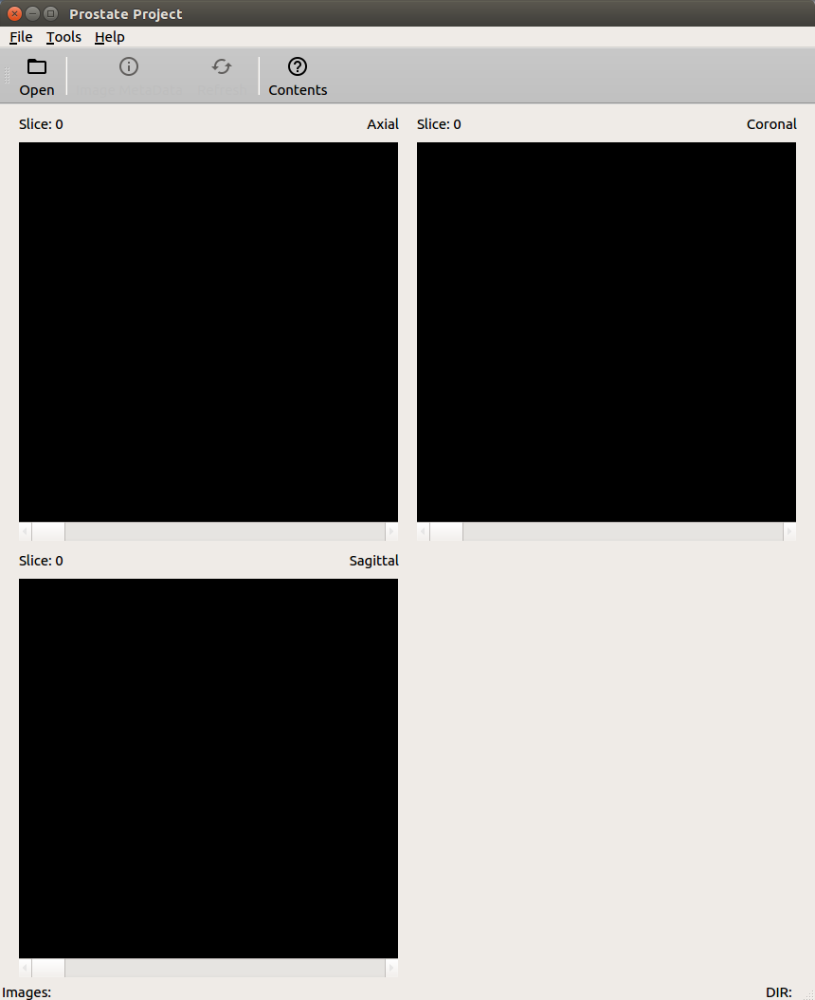
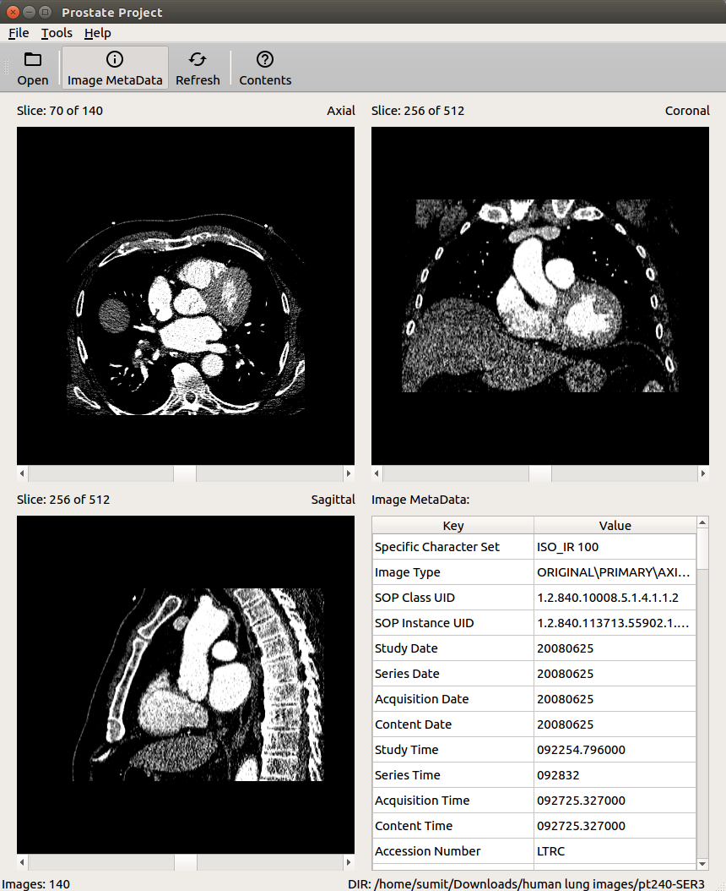

# DICOM Viewer - A basic application to view DICOM images developed in Qt for Ubuntu platform.
## Prerequisite Frameworks
- Qt 5.9.1
- ITK 4.12
- VTK 8.0
- GDCM 2.6.3
## Features
- View DICOM images in three separate views (axial, coronal and sagittal)
- Interact with images
  - Translate and scale images
  - Change slices
  - Change intensity/color
## Installing software
- Install prerequisite frameworks.
- Download and unzip the contents of [QtDICOMViewer](https://github.com/codeman110/QtDICOMViewer/archive/master.zip).
- Open **QtCreator**.
- Goto ```File``` -> ```Open File or Project``` and open the **"QtDICOMViewer.pro"** file.
- In ```Configure Project``` window select **"Desktop Qt 5.9.1 GCC 64bit"** kit and select ```Configure Project``` button.
## Screenshots
 
## Changelog
- [x] Read and display DICOM images using VTK
- [x] Display all three views - axial, coronal and sagittal
- [x] Read images using ITK and display images using VTK
- [x] Display image metadata
- [ ] Simultaneous image interaction for all three views (change in intensity/color)
- [ ] User guide (software manual)
